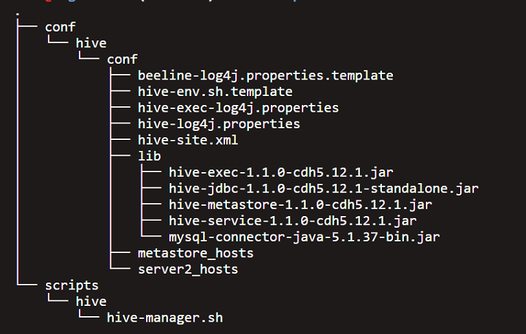

## 准备工作
1. 准备一台部署的主控机，主控机可以ssh无密码登录到要部署hive服务的机器。同时，主控机可以使用pssh、pscp、prsync等命令
2. 要部署hive服务的机器提前安装好hadoop客户端，同时准备好要连接的MySQL数据库

## 服务组成
Hive服务部署包括HiveServer2和Metastore两部分，hiveserver2和metastore部署步骤基本一致，不同服务部署时只需修改相应的conf目录下hosts文件即可

## 目录结构

## 部署步骤
1. 登录到主控机  
2. 修改配置文件：`cd cdh-hadoop-install/conf/hive/conf`，修改metastore_hosts和server2_hosts文件，分别写入要安装metastore和hiveserver2的ip地址(目前测试server2_hosts和metastore_hosts内容是相同的)。实际的业务需求和机器配置差异较大，请根据自身需求修改hive-site.xml配置文件 
3. 安装hiveserver2和metastore服务：`cd cdh-hadoop-install/scripts/hive`，`sh hive-manager.sh install server2_hosts`  
4. 同步配置文件：`sh hive-manager.sh sync`  
5. 启动metastore和hiveserver2服务：`sh hive-manager.sh start`

## 服务管理
1. 停止服务：`sh hive-manager.sh stop`
2. 重启服务：`sh hive-manager.sh restart`
3. 修改配置文件后同步：`sh hive-manager.sh sync`(修改配置文件后，一般需要重启服务)

## 服务卸载
`sh hive-manager.sh remove server2_hosts`

## 服务验证
   登录任意hive服务所在机器，`beeline -n tuhu -u "jdbc:hive2://big-data-5:10000/default"`，执行`show databases;show tables;select count(1);`等命令，查看是否返回正确的执行结果
