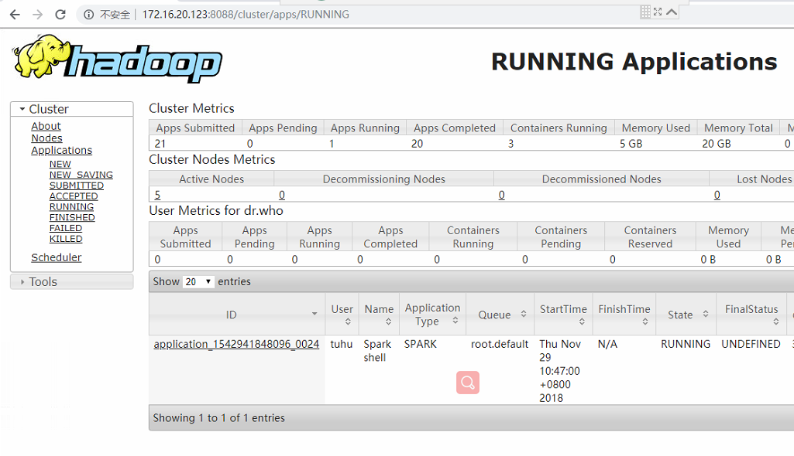
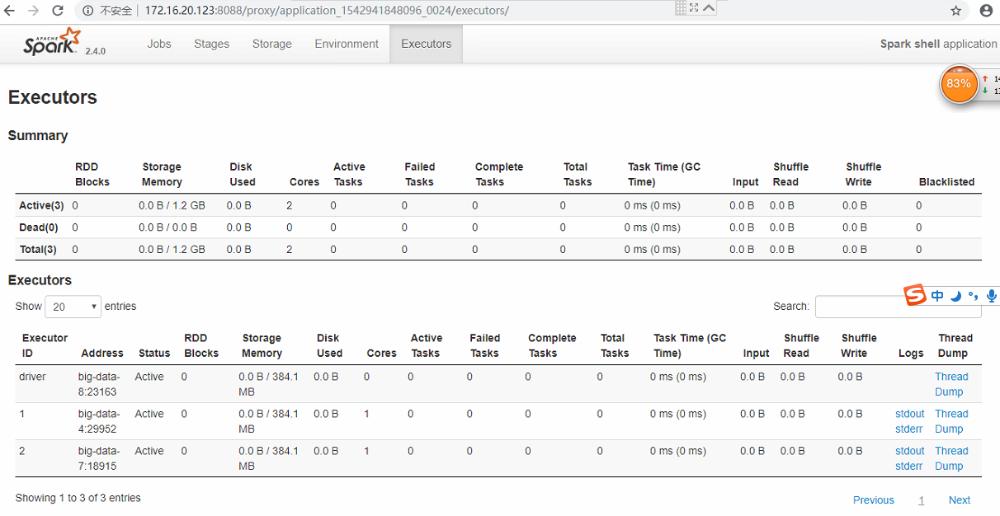
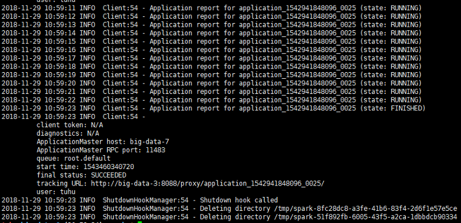

## 准备工作
部署spark客户端依赖如下准备工作：
1. 预先部署好了hadoop，相关配置文件在 /etc/hadoop/conf 下
2. 部署好java，有 JAVA_HOME = 比如 /usr/local/java...
3. 需要预先将[spark相应安装包](http://spark.apache.org/downloads.html )下载好，（后放到ftp服务器中）
4. 如果要使用spark-sql，则需要依赖hive的部署，以及一些相关配置文件

## 部署思路
spark客户端的部署分为如下几个步骤
1. 下载二进制包; 
2. 解压并移动到相应目录；
3. 修改配置文件和环境变量等；

其中核心的配置均在配置文件中

## 部署步骤
1. 做好准备工作； 
2. cd 到 cdh-hadoop-install 目录下；
3. 运行脚本 `./scripts/spark/install-spark.sh`；
4. 测试spark客户端是否部署OK；
5. 部署 spark history server；

## 验证步骤

1. 验证spark-shell: 

   ``` sh
   cd /usr/local/spark
   ./bin/spark-shell
   ```


2. 验证spark on yarn:

``` sh
su tuhu
./bin/spark-shell --master yarn
```

出现如下界面:

点击 ApplicationMaster链接，则转入对应的spark UI 界面：

则说明spark on yarn 成功

3. 验证 spark on yarn cluster 模式

``` sh
su tuhu
./bin/run-example --master yarn-cluster SparkPi
```

则说明spark on yarn cluster 成功，也可以继续去yarn中查阅相关作业；

还可以跑一些其它应用程序，具体查阅官网，这里就不一一列出了